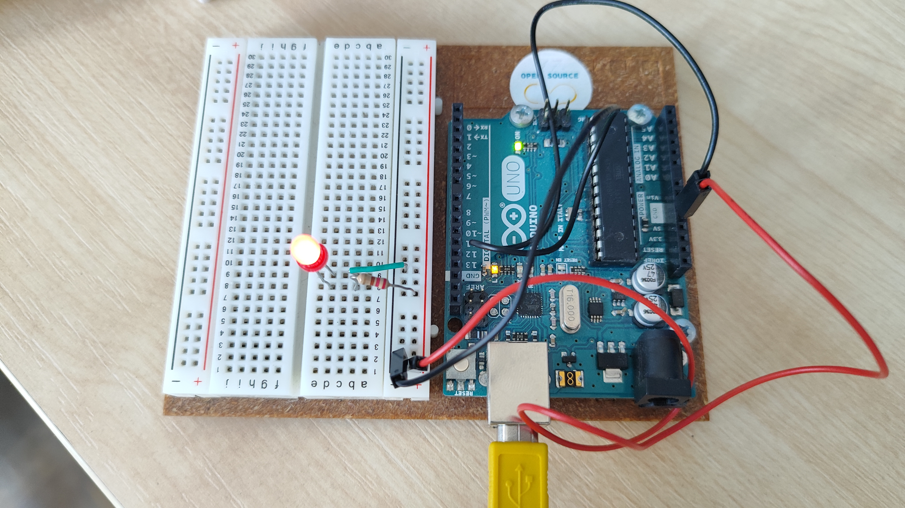
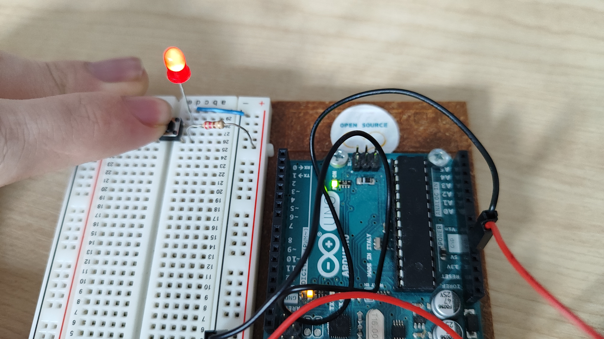
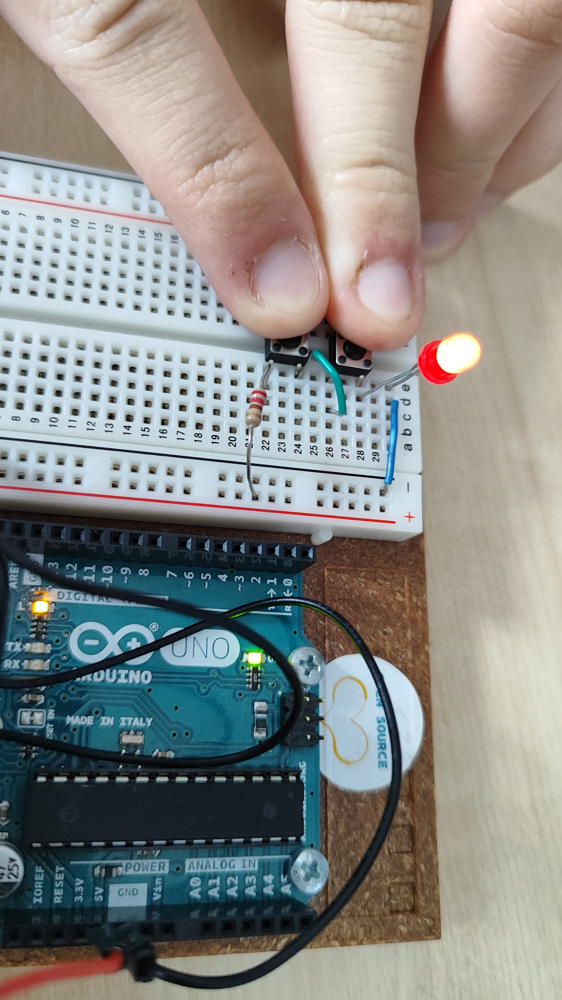
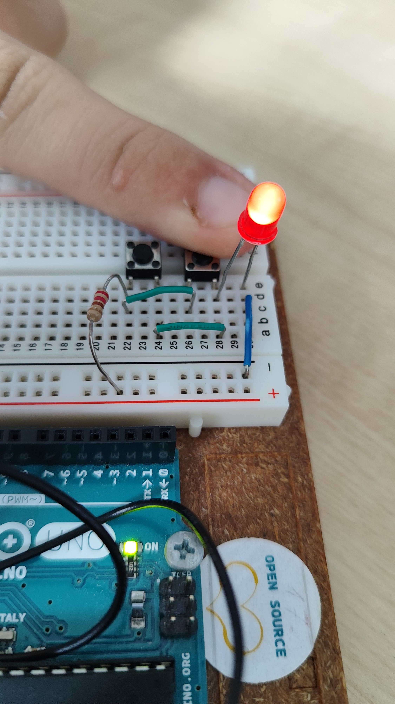
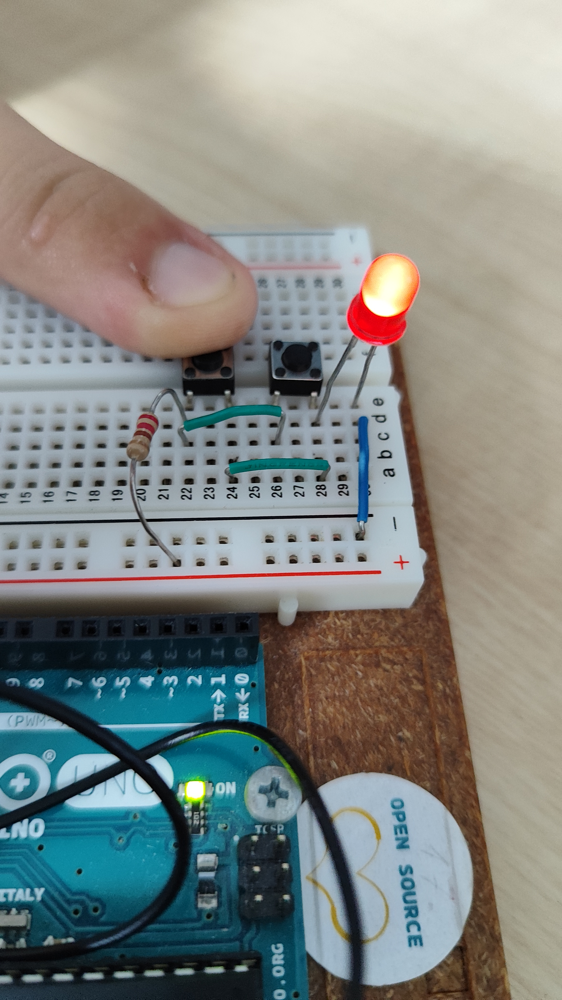

## Projekts 1 "Get to know your Tools"

### Iepazišanas ar Arduino

Pirmaja projektā mes noskaidrojam kā strādat ar elektro komponentiem

1. LED lampiņa pieslēgšana pie Arduino.
    - Darba izmantojas
        - LED lampiņa
        - vadi
        - Resistors uz 220om

- Rezultats
    - pievienojot arduino pie elektrības **lampiņa sāk degt**

-------------

2. LED lampiņas pieslēgšana **caur pogu**.
    - Darba izmantojas;
        - LED lampiņa
        - 2 vadi
        - Resistors uz 220om
        - Poga

- Rezultats
    - pievienojot arduino pie elektrības un uzpiežot uz pogas **lampiņa iedēgas**.

-------------

3. LED lampiņas pieslēgšana ar **Ķēde savienotas pogas**.
    - Darba izmantojas;
        - LED lampiņa
        - 3 vadi
        - Resistors uz 220om
        - 2 pogas

- Rezultats
    - pievienojot arduino pie elektrības un uzpiežot **vienlaicīgi** pogas kas savienotas ķede viens aiz otrā **lampiņa sāk degt**

-------------

4. LED lampiņas pieslēgšana ar **paralēli savienotām pogam**.
    - Darba izmantojas;
        - LED lampiņa
        - 3 vadi
        - Resistors uz 220om
        - 2 pogas

- Rezultats
    - pievienojot arduino pie elektrības un uzpiežot **vienu** no pogam vai abas vienlaicīgi **lampiņa sāk degt**

-------------

