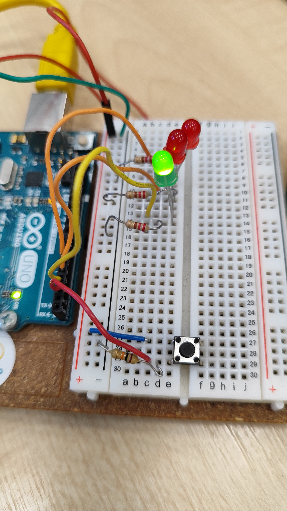
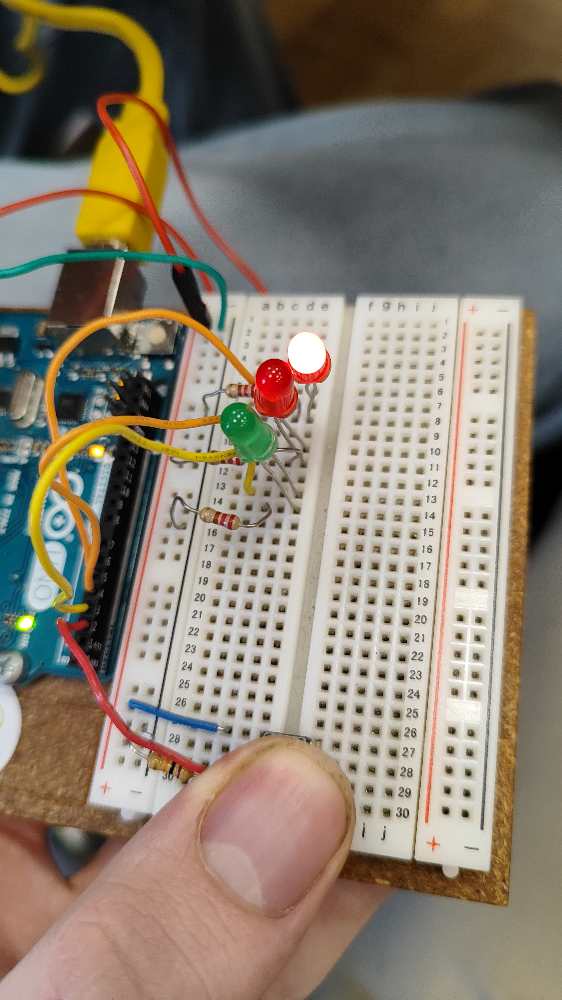

## Projekts 2 "Spaceship Interface"

### Kosmoskuģa interfeis

1. Kosmoskuģa interfeis.
    - Darba izmantojas
        - 2 LED lampiņa sarkana krāsa
        - 1 LED lampiņa zaļā krāsa
        - poga
        - Resistors uz 220om
        - Resistors uz 10Kom

Izvediojam shēmu kā gramata un pieslēdzam pie datora ar USB vadu, atvēram redaktoru, pāarakstam programas kodu saglabajam uz arduino

-----------------
**Arduino kods:**

```c++
int switchState = 0; 

void setup(){

  pinMode(3,OUTPUT);
  pinMode(4,OUTPUT);
  pinMode(5,OUTPUT);
  pinMode(2,INPUT);

}

void loop(){

  switchState = digitalRead(2);

  if(switchState == LOW){

    digitalWrite(3, HIGH);
    digitalWrite(4, LOW);
    digitalWrite(5, LOW);

  }

  else{
    digitalWrite(3, LOW);
    digitalWrite(4, LOW);
    digitalWrite(5, HIGH);

    delay(250);
    digitalWrite(4, HIGH);
    digitalWrite(5, LOW);
    delay(250);

  }

}
```
-----

- Rezultatā jabūt
    - Zaļa lamoiņa nepartraukti dēg kamēr nepiespiedīs pogu, tad zaļa LECD lampiņa nodziest un sarkanas sāk mirgot.



