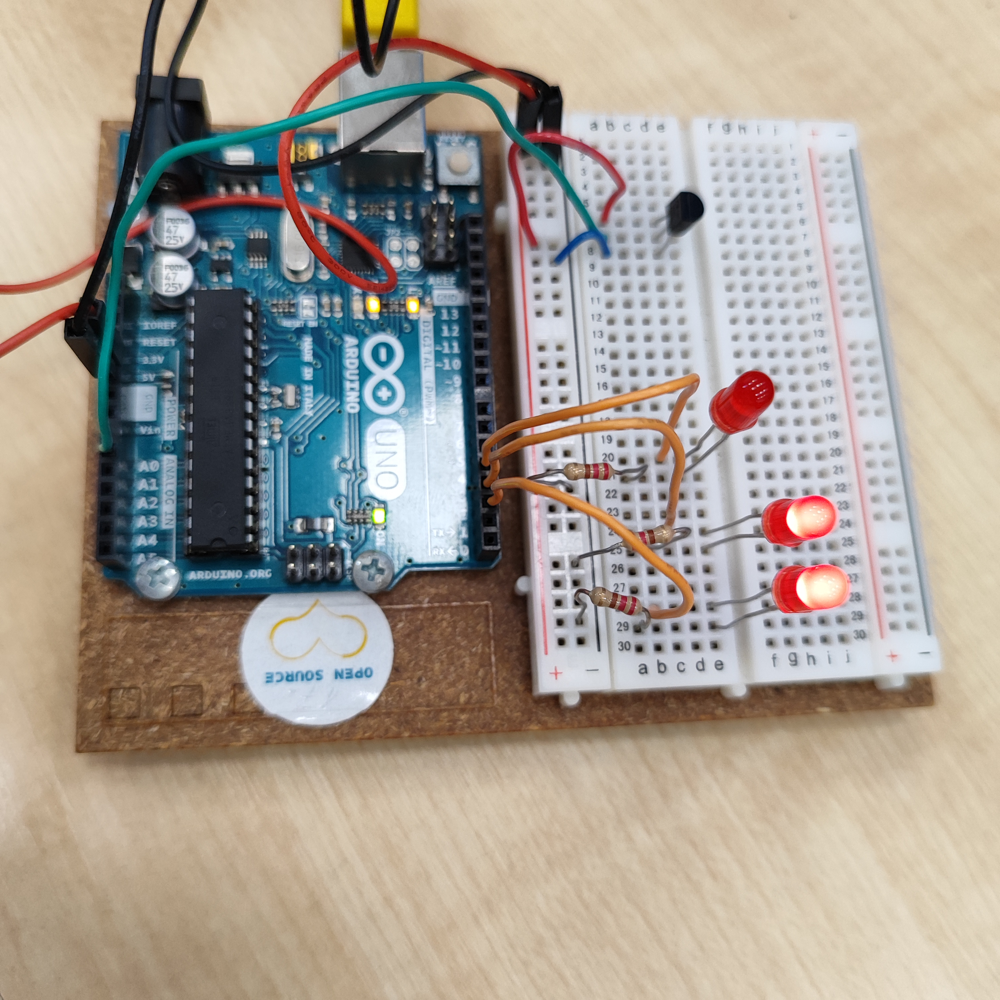
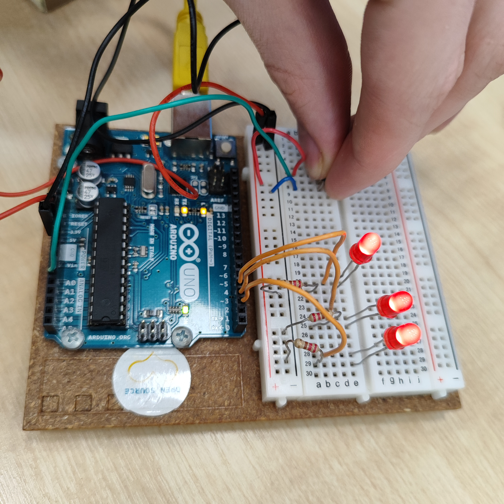

## Projekts 2 "Spaceship Interface"

### Kosmoskuģa interfeis

1. Kosmoskuģa interfeis.
    - Darba izmantojas
        - 3 LED lampiņa sarkana krāsa
        - 3 Resistors uz 220om
        - TMP temperaturas sensors

Izvediojam shēmu kā gramata un pieslēdzam pie datora ar USB vadu, atvēram redaktoru, pāarakstam programas kodu saglabajam uz arduino

-----

- Rezultatā jabūt
    - termometras kas atkarīgi no temperaturas iededzinā 1 vai 2 vai 3 lampiņas, no sākuma deg tikai viena lampiņa, saspiežot temperaturas ar pirkstiem sensoru iedēgās pārejas lampiņas signalizējot kā temperatura pacēlas.

izmerā apkartējas vides temperaturu.

izmēra pirkstu temperaturu.

